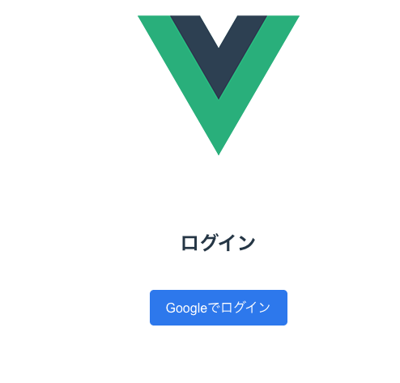

### Day 1-2完了！
Google認証まで実装できた
firebaseでは、認証とホスティングが一緒にできることを知った。
明日はログイン画面のダッシュボード作成頑張ってみよう💪

#### ログイン画面

### Day 3完了
✅ ダッシュボード機能実装
✅ ログイン→ダッシュボード→ログアウトの流れ完成
✅ Vueの監視システム理解
✅ data()とライフサイクルの違いを理解

data()はコンポーネントされたときにリアクティブな変数を作成してくれる。
mounted()はマウントされるたびに実行される。